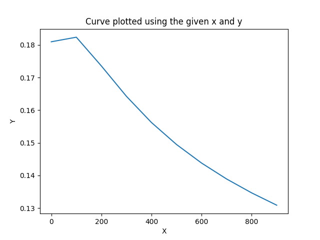
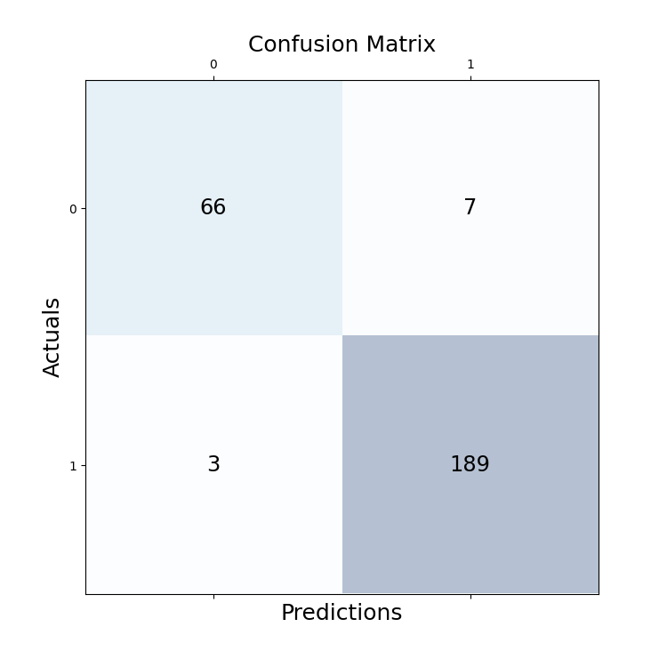

# ML- Basic Logistic Regression model - From Scratch using Python - Easy.

## Learning objectives

- How a basic logistic regression model works.


## Description

In this repository, I show how to implement a very basic logistic regression model using python3. I built the model to be able to solve a classification problem (Spam Detection). I used OOP programming in this task but also functional programming. For the ones who prefer working with Jupyter Notebooks, I also wrote a version for Jupyter Notebook or Colab which is in the repo.


This is the learning curve of the model:



And here is the Confusion Matrix of the Model on the Spam and Ham dataset:




### Task requirements

There are really few libraries needed since I wanted to build it from scratch the model. You will essentially need numpy, pandas, matplotlib, nltk (for pos_tagging), and spacy for lemmaization. But if you want to run on the same environment as me, you can install the same packages I had for building this model using pip or pip3.

Before installing the packages be sure to run in a virtual environment. If you don't know how to do it, just open the terminal in the folder where you want to start coding and run this:

```
   python -m venv env
```


it will create a virtual environment where you will be able to easily manage your packages for this particular task. Then run this  command to activate the virtual env (Be sure to be in the folder where you ran the previous command):

```
    source env/bin/activate
``` 

to install the packages run the following command:


```
    pip install -r requirements.txt
```

### Author

👤 **Alex Eponon**
​
- GitHub: [@Anvi98](https://github.com/Anvi98)

- Twitter: [@anvi_al](https://twitter.com/anvi_al)

- LinkedIn: [Alex Eponon](https://www.linkedin.com/in/anvi-alex-eponon/)

**Give me a star if you liked it**
